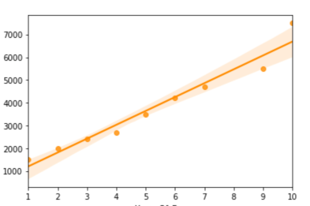
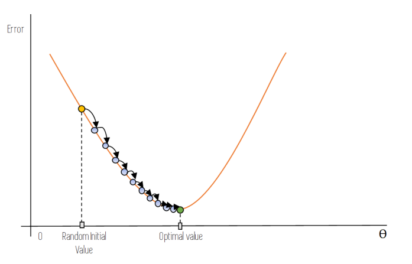
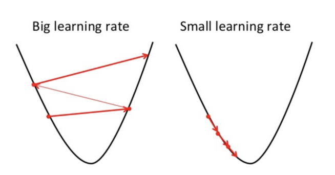

# Topic: Linear Regression

**Author**: Takem Darlington

**QAs Total**: 3

---

## Q: How would you approach a _Linear Regression_ problem?

**Difficulty:** `Junior`

**Source:**

https://towardsdatascience.com/linear-regression-explained-d0a1068accb9

**Answer:**

Linear regression is used for finding **linear relationship** between target and one or more predictors. In the most simplest form, we are finding the relationship between two continuous variables. One is **predictor(independent)** variable and other is **response(dependent)** variable. The equation below is a simple representation.

$Y = B + AX$

where Y is the predicted value, B is the bias, A is a weight, and  is the _independent_ variable.

There are three basic steps to follow:
- Clean the data
- Split the data to train and test
- Create the Linear Regression Model
- Fit in the training data
- Use the test data to calculate the accuracy
- and voila

---

## Q: How do we fine the best fit for the lline in a linear regression model?

**Difficulty:** `Medium`

**Source:**

https://towardsdatascience.com/line-of-best-fit-in-linear-regression-13658266fbc8

**Answer:**

To look for the best fit line for our model, we have to make the **distance** with respect to all the points **minimum**. We have to find that line which is closest to all the points. This is known as the *residual* in statistics.

Residual is equal to the difference between the observed value and the predicted value.

$residual = y - \bar{y}$

The distance is known as **Sum of Squared Residuals(SSE)** and the method is known as **Least Squares Method**.

$sum of squarred residue = \sum (y - \bar{y})^2$

---

## Q: Eplain Gradient Descent to your Grandmother

**Difficulty:** `Senior`

**Source:**

https://towardsdatascience.com/gradient-descent-explained-9b953fc0d2c

**Answer:**

Gradient descent is an optimization algorithm that’s used when training a machine learning model and is based on a convex function and tweaks its parameters iteratively to minimize a given function to its local minimum(that is, *slope = 0*).

For a start, we have to select a random bias and weights, and then iterate over the slope function to get a slope of 0.

The way we change update the value of the bias and weights is through a variable called the learning rate. We have to be wise on the learning rate because choosing:
* A small leaning rate may lead to the model to take some time to learn
* A large learning rate will make the model converge as our pointer will shoot and we’ll not be able to get to minima.

